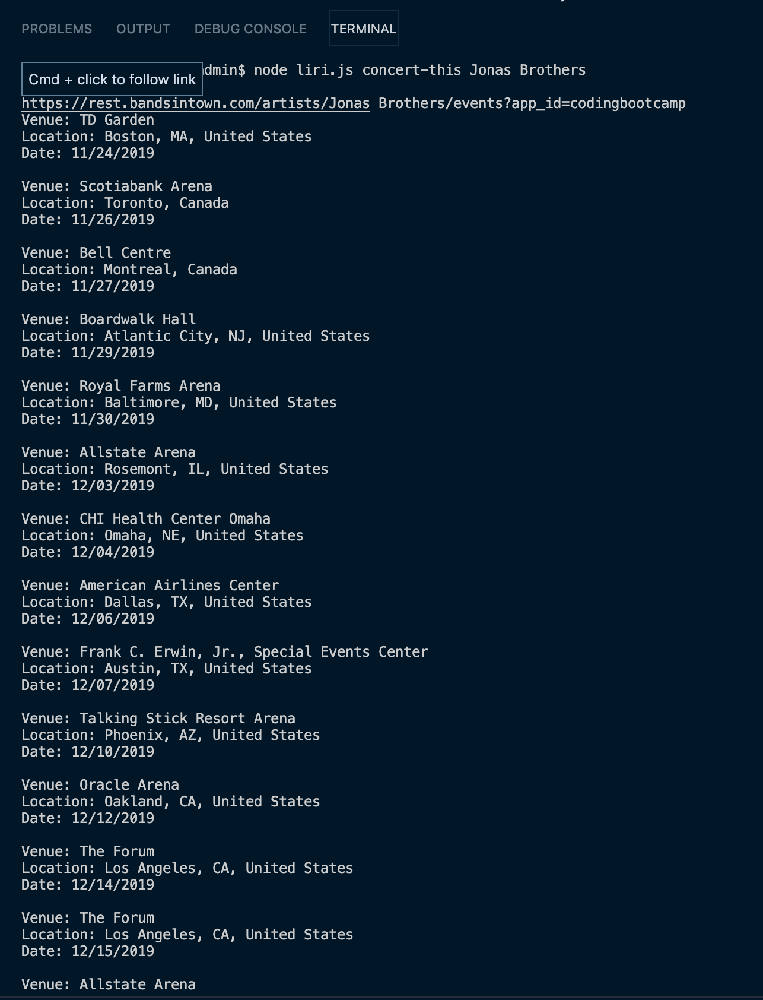
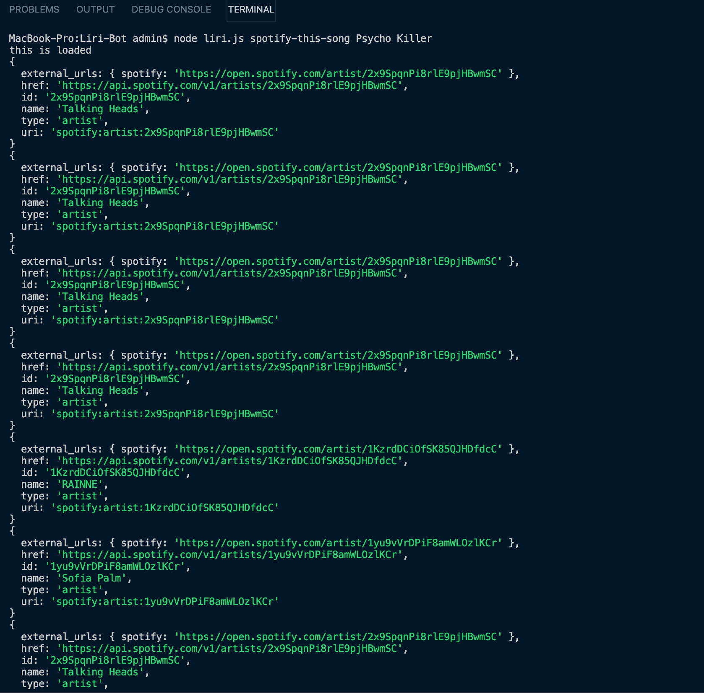
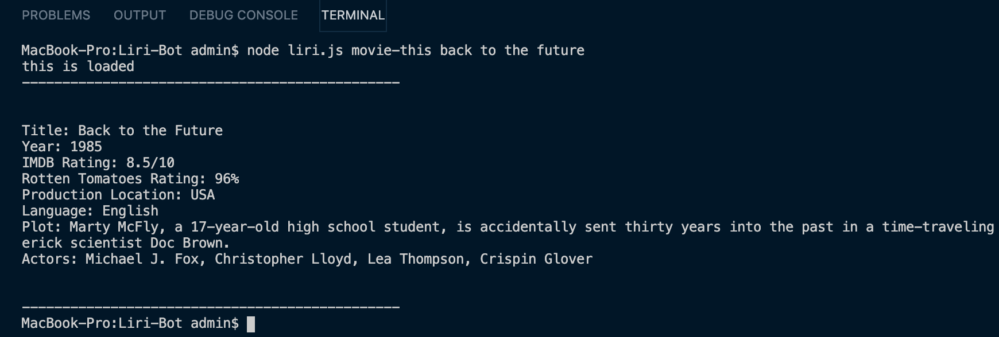
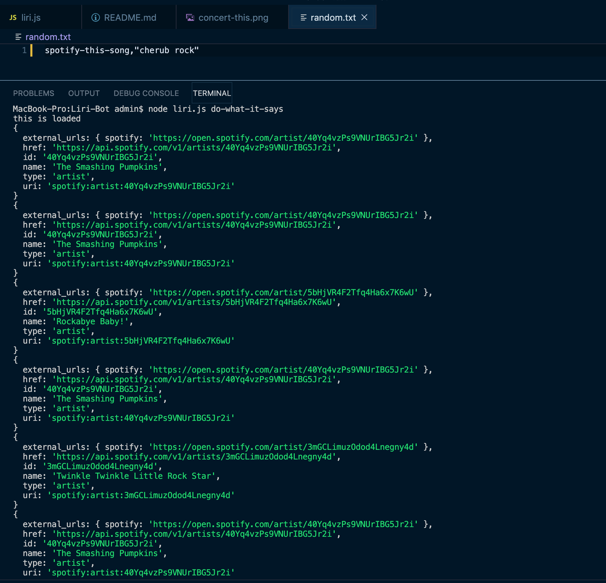

# LIRI-Bot

Welcome to LIRI-Bot. Via your inputs in terminal, LIRI will search Spotify for songs, Bands in Town for concerts, and OMDB for movies.
It will accomplish this by using the necesary modules/packages.
Via API calls, the data will be returned in JSON format. It will be parsed and displayed (output) in the format specified.

## How To Use:

You are givent the choice of four commands to input into the Terminal:

```
concert-this, spotify-this-song, movie-this, do-what-it-says
```

"node liri.js" (without quotes) must precede any of the above commands.

If you input something wrong, then you will see "Please try again" on the display. This means that you need to start over.

## Screen shots of the app working

#### **"concert-this"**

- Here is what happens when the user inputs "node liri.js concert-this Jonas Brothers"
  

#### **"spotify-this-song"**

Here's what happens when the user inputs "node liri.js spotify-this-song Psycho Killer":



#### **"movie-this"**

This is what happens when you type "node liri.js movie-this back to the future" into the Terminal:



#### **"do-what-it-says"**

Below is an example of what happens when "node liri.js do-what-it-says" is typed. The random.txt file is read from the doThis function, then whatever is written into random.txt is used as the search parameters.


## Technologies Used

- Node.js
- Javascript
- Spotify API (via node-spotify-api npm module)
- OMDb API (via Axios npm module)
- Bands In Town (via Axios npm module)
- Moment.js (to convert the date response from our concert data)
- FS (File System npm module)
